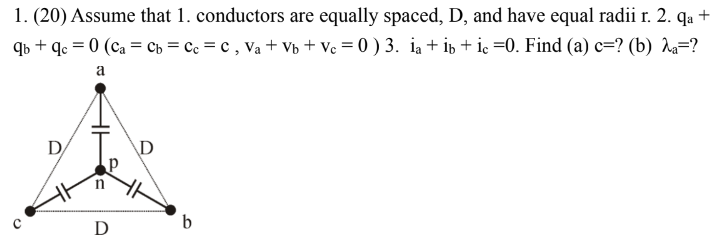
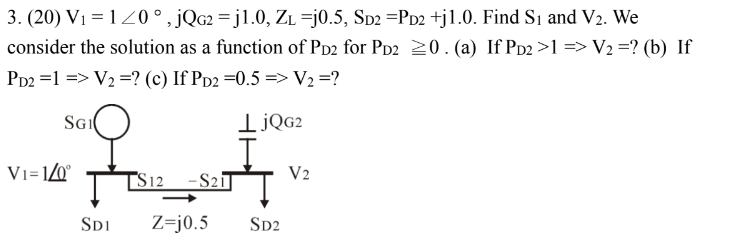
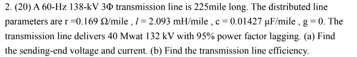
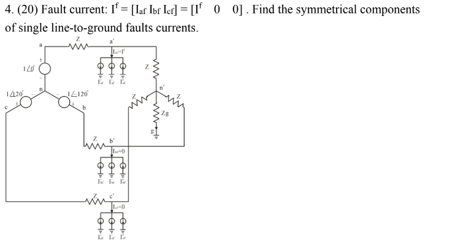
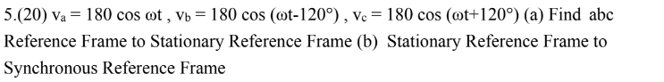

# Introduction to Electrical Power Engineering
## Final Exam

---

## 1. a.

Assume that

1. Conductors are equally spaced, \(D\), and have equal radii \(r\).
2. \(q_a + q_b + q_c = 0\) (\(c_a = c_b = c_c = c\), \(v_a + v_b + v_c = 0\)).

\[
v_a = \frac{1}{2\pi \epsilon} \left( q_a \ln \frac{1}{r} + q_b \ln \frac{1}{D} + q_c \ln \frac{1}{D} \right) = \frac{1}{2\pi \epsilon} \left( q_a \ln \frac{1}{r} - q_a \ln \frac{1}{D} \right) = \frac{1}{2\pi \epsilon} \left( q_a \ln \frac{D}{r} \right)
\]

**\[
C = \frac{q}{v}, \quad c_a = c_b = c_c = c = \frac{2\pi \epsilon}{\ln (D/r)} \quad (\text{F/m}) \text{ to neutral}
\]**

\[
c_a = c_b = c_c = 2\pi \epsilon \ln \frac{D_m}{r} \text{ for one line transposition}
\]

\[
c_a = c_b = c_c = 2\pi \epsilon \ln \frac{D_m}{R_{GMR}} \text{ for conductor bundling transposition}
\]

\[
D_m = (D_{12} D_{23} D_{13})^{1/3}
\]

\[
R_b^c = R_{GMR} = (r d_{12} d_{13} d_{1b})^{1/b}, \quad b > 1; \quad R_b^c = R_{GMR} = r, \text{ when } b = 1
\]

---

## 1. b. 

Assume that 
1. Conductors equally spaced \(D\) and have equal radii \(r\).
2. \(i_a + i_b + i_c = 0\).

**\[
\lambda_a = \left( \frac{\mu_0}{2\pi} \right) \left\{ i_a [\mu_r/4 + \ln(1/r)] + i_b \ln(1/D) + i_c \ln(1/D) \right\}
\]**

\[
= \left( \frac{\mu_0}{2\pi} \right) \left\{ i_a [\mu_r/4 + \ln(1/r)] - i_a \ln(1/D) \right\}
\]

\[
= \left( \frac{\mu_0}{2\pi} \right) \left[ \mu_r/4 + \ln(1/r) - \ln(1/D) \right] \times i_a
\]

\[
= \left( \frac{\mu_0}{2\pi} \right) \left[ \ln e^{(\mu_r/4)} + \ln(1/r) - \ln(1/D) \right] \times i_a
\]

\[
= \left( \frac{\mu_0}{2\pi} \right) \left[ \ln(1/r e^{-(\mu_r/4)}) - \ln(1/D) \right] \times i_a
\]

\[
= \left( \frac{\mu_0}{2\pi} \right) \left[ \ln(1/r') - \ln(1/D) \right] \times i_a
\]

\[
= \left( \frac{\mu_0}{2\pi} \right) \left[ \ln(D/r') \right] \times i_a
\]

**\[
= l_a \times i_a
\]**

---

## 2. a.

\( z = r + j \omega l \) = series impedance per meter

\( y = g + j \omega c \) = shunt admittance per meter to neutral

\( \frac{dV}{dx} = z I \) ; \( \frac{dI}{dx} = y V \)

\( \frac{d^2V}{dx^2} = yz V = \gamma^2 V \) ; \( \frac{d^2I}{dx^2} = yz I = \gamma^2 I \)

Propagation constant: \( \gamma = (yz)^{0.5} = \alpha + j \beta \)

\( V = k_1 e^{\gamma x} + k_2 e^{-\gamma x} = (k_1 + k_2) \frac{(e^{\gamma x} + e^{-\gamma x})}{2} + (k_1 - k_2) \frac{(e^{\gamma x} - e^{-\gamma x})}{2} \)
\[
V = K_1 \cosh \gamma x + K_2 \sinh \gamma x \quad ; \quad K_1 = (k_1 + k_2) \quad , \quad K_2 = (k_1 - k_2)
\]

\[
\frac{dV}{dx} = K_1 \gamma \sinh \gamma x + K_2 \gamma \cosh \gamma x \quad \text{(4.8)}
\]

When \( x=0 \), \( V=V_2 \) \( \Rightarrow \) \( V = k_1 + k_2 = K_1 = V_2 \),

When \( x=0 \), \( I = I_2 \) \( \Rightarrow \frac{dV(0)}{dx} = z I_2 = K_2 \gamma = (z/\gamma)I_2 = (z/y)^{0.5} I_2 \)

\( Z_c = (z/y)^{0.5} \) (characteristic impedance)

\( V = V_2 \cosh \gamma x + Z_c I_2 \sinh \gamma x \quad ; \quad I = I_2 \cosh \gamma x + (V_2 / Z_c) \sinh \gamma x \)

**When \( x = l \), \( V = V_1 \) , \( I = I_1 \Rightarrow \)**

**\[
V_1 = V_2 \cosh \gamma l + Z_c I_2 \sinh \gamma l ;
\]**

**\[
I_1 = I_2 \cosh \gamma l + (V_2 / Z_c) \sinh \gamma l
\]**

---

## 2. b. 

\( z = r + j \omega l = 0.169 + j0.789 = 0.807 \angle 77.9^\circ \ \Omega/\text{mile} \)

\( y = g + j \omega c = j5.38 \times 10^{-6} = 5.38 \times 10^{-6} \angle 90^\circ \ \text{mho/mile} \)

\( \Rightarrow Z_c = (z/y)^{0.5} = 387.3 \angle -6.05^\circ \ \Omega \)

\( \Rightarrow \gamma l = 225 (y z)^{0.5} = 0.4688 \angle 83.95^\circ = 0.0494 + j0.466 \)

\[
2 \sinh \gamma l = e^{\gamma l} - e^{-\gamma l} = e^{0.0494} e^{j0.466} - e^{-0.0494} e^{-j0.466} = 1.051 \angle 0.466 \ \text{rad} - 0.952 \angle -0.466 \ \text{rad}
\]

\[
\sinh \gamma l = 0.452 \angle 84.4^\circ
\]

\[
2 \cosh \gamma l = e^{\gamma l} + e^{-\gamma l} = 1.051 \angle 0.466 \ \text{rad} + 0.952 \angle -0.466 \ \text{rad} = 1.790 \angle 1.42^\circ
\]

\[
\cosh \gamma l = 0.895 \angle 1.42^\circ
\]

\[
|V_2| = 132 \times 10^3 / \sqrt{3} = 76.2 \ \text{kV} \Rightarrow V_2 = 76.2 \angle 0^\circ \ \text{kV}
\]

**\[
1\Phi \ P_{\text{load}} = 40 \times 10^6 / 3 = 13.33 \ \text{MW} = 0.95 |V_2| |I_2| \Rightarrow |I_2| = 184.1, \ I_2 = 184.1 \angle -18.195^\circ
\]**

\[
V_1 = V_2 \cosh \gamma l + Z_c I_2 \sinh \gamma l \Rightarrow V_1 = 89.28 \angle 19.39^\circ \ \text{kV} \Rightarrow V_{LL} = \sqrt{3} \times 89.28 = 154.64 \ \text{kV}
\]

\[
I_1 = I_2 \cosh \gamma l + (V_2 / Z_c) \sinh \gamma l = 162.42 \angle 14.76^\circ \ \text{A}
\]

**\[
P_{12} = \text{real} (V_1 I_1^*) = 89.28 \times 10^3 \times 162.42 \cos (19.39^\circ - 14.76^\circ) = 14.45 \ \text{MW}
\]**

**Efficiency \( = \frac{13.33}{14.45} = 0.92 = 92\% \)**

---

## 3. a. b. c. 

In this case, the capacitor injects a specified power, while the voltage is not controlled. Thus bus2 is a P, Q bus. In fact,

\[
S_2 = S_{21} = S_{G2} - S_{D2} = j1.0 - (P_{D2} + j1.0) = - P_{D2}
\]

\[
S_{12} = |V_1|^2 e^{j \angle Z} / |Z| - |V_1| |V_2| e^{j \angle Z} e^{j \theta_{12}} / |Z|
\]

\[
S_{21} = |V_2|^2 e^{j \angle Z} / |Z| - |V_1| |V_2| e^{j \angle Z} e^{-j \theta_{12}} / |Z|
\]

\[
R = 0, \quad Z = jX = j0.5 \Rightarrow \angle Z = 90^\circ, \quad e^{j \angle Z} = j, \quad |V_1| = 1
\]

\[
S_{21} = j2 |V_2|^2 - j2 |V_2| e^{-j \theta_{12}} = - P_{D2}
\]

We draw a receiving-end circle:

\[
(2|V_2|^2)^2 + (P_{D2})^2 = (2|V_2|)^2 \Rightarrow 4|V_2|^4 - 4|V_2|^2 + (P_{D2})^2 = 0
\]

\[
|V_2|^2 = \left[ 1 \pm (1 - (P_{D2})^2)^{0.5} \right] / 2
\]

**If \( P_{D2} > 1 \Rightarrow |V_2| \) has no solution,**

**If \( P_{D2} = 1 \Rightarrow |V_2| = 0.707, \ \theta_{12} = 45^\circ \)**
If \( 0 \leq P_{D2} \leq 1 \Rightarrow |V_2| \) has **two solutions**

We can find \( \theta_{12} \) and \( S_1 = S_{12} \)

**If \( P_{D2} = 0.5 \Rightarrow V_2 = 0.97 \angle -15^\circ \) (OK) and \( V_2 = 0.26 \angle -75^\circ \) (not OK)**

---

## 4. 

\[
(13.5) \quad \begin{bmatrix} I_{af} & I_{bf} & I_{cf} \end{bmatrix} = A \begin{bmatrix} I^0_{af} & I^+_{af} & I^-_{af} \end{bmatrix}
\]

\[
(13.6) \quad A = \begin{bmatrix} 1 & 1 & 1 \\ 1 & \alpha & \alpha^2 \\ 1 & \alpha^2 & \alpha \end{bmatrix}
\]

Fault current: 

\[
I^f = \begin{bmatrix} I_{af} & I_{bf} & I_{cf} \end{bmatrix} = \begin{bmatrix} I^f & 0 & 0 \end{bmatrix}
\]

\[
I_{af} = I^0_{af} + I^+_{af} + I^-_{af} = I^f
\]

\[
I_{bf} = I^0_{bf} + I^+_{bf} + I^-_{bf} = \left( \frac{I^f}{3} \right) \begin{bmatrix} 1 & \alpha^2 & \alpha \end{bmatrix} = 0
\]

\[
I_{cf} = I^0_{cf} + I^+_{cf} + I^-_{cf} = \left( \frac{I^f}{3} \right) \begin{bmatrix} 1 & \alpha & \alpha^2 \end{bmatrix} = 0
\]

\[
A^{-1} = \left( \frac{1}{3} \right) \begin{bmatrix} 1 & 1 & 1 \\ 1 & \alpha & \alpha^2 \\ 1 & \alpha^2 & \alpha \end{bmatrix}
\]

\[
\begin{bmatrix} I^0_{af} & I^+_{af} & I^-_{af} \end{bmatrix} = A^{-1} \begin{bmatrix} I^f & 0 & 0 \end{bmatrix} = \left( \frac{I^f}{3} \right) \begin{bmatrix} 1 & 1 & 1 \end{bmatrix}
\]

**\[
I^+_{af} = I^-_{af} = I^0_{af} = \left( \frac{I^f}{3} \right)
\]**

Using Superposition:

- Positive Sequence
- Negative Sequence
- Zero Sequence

---

## 5. a. 

\[
\begin{bmatrix} v_{qs} \\ v_{ds} \end{bmatrix} = \begin{bmatrix} 2/3 & -1/3 & -1/3 \\ 0 & -1/\sqrt{3} & 1/\sqrt{3} \end{bmatrix} \begin{bmatrix} v_a \\ v_b \\ v_c \end{bmatrix}
\]

\[
\begin{bmatrix} v_a \\ v_b \\ v_c \end{bmatrix} = \begin{bmatrix} 1 & 0 \\ -1/2 & -\sqrt{3}/2 \\ -1/2 & \sqrt{3}/2 \end{bmatrix} \begin{bmatrix} v_{qs} \\ v_{ds} \end{bmatrix}
\]

3-phase 220V\(_{rms}\) (60Hz, line-to-line), \(\omega = 2 \pi f = 120 \pi = 377 \text{ rad/sec}\).

\( v_a + v_b + v_c = 0 \), balanced system, (\( v_a + v_b + v_c \neq 0 \), unbalanced system)

\[
v_a = 180 \cos \omega t, \quad v_b = 180 \cos (\omega t - 120^\circ), \quad v_c = 180 \cos (\omega t + 120^\circ)
\]

**abc Reference Frame to Stationary Reference Frame**

**\[
v_{qs} = \left( \frac{2}{3} \right) v_a + \left( -\frac{1}{3} \right) v_b + \left( -\frac{1}{3} \right) v_c = \left( \frac{2}{3} \right) v_a + \left( \frac{1}{3} \right) v_a = v_a = 180 \cos \omega t
\]**

**\[
v_{ds} = \left( -\frac{1}{\sqrt{3}} \right) v_b + \left( \frac{1}{\sqrt{3}} \right) v_c = \left( -\frac{1}{\sqrt{3}} \right) [v_a + 2v_b] = -180 \sin \omega t
\]**

Stationary Reference Frame to abc Reference Frame

\[
v_a = v_{qs}, \quad v_b = \left( -\frac{1}{2} \right) v_{qs} + \left( -\frac{\sqrt{3}}{2} \right) v_{ds} = 180 \cos (\omega t - 120^\circ)
\]

\[
v_c = \left( -\frac{1}{2} \right) v_{qs} + \left( \frac{\sqrt{3}}{2} \right) v_{ds} = 180 \cos (\omega t + 120^\circ)
\]

---

## 5. b. 

\[
\begin{bmatrix} v_{qe} \\ v_{de} \end{bmatrix} = \begin{bmatrix} \cos \omega t & -\sin \omega t \\ \sin \omega t & \cos \omega t \end{bmatrix} \begin{bmatrix} v_{qs} \\ v_{ds} \end{bmatrix}
\]

\[
\begin{bmatrix} v_{qs} \\ v_{ds} \end{bmatrix} = \begin{bmatrix} \cos \omega t & \sin \omega t \\ -\sin \omega t & \cos \omega t \end{bmatrix} \begin{bmatrix} v_{qe} \\ v_{de} \end{bmatrix}
\]

3-phase 220V\(_{rms}\) (60Hz, line-to-line), \(\omega = 2 \pi f = 120 \pi = 377 \text{ rad/sec}\).

\( v_{qs} = 180 \cos \omega t, \quad v_{ds} = -180 \sin \omega t \)

**Stationary Reference Frame to Synchronous Reference Frame**

**\[
v_{qe} = \cos \omega t \ v_{qs} - \sin \omega t \ v_{ds} = 180
\]**

**\[
v_{de} = \sin \omega t \ v_{qs} + \cos \omega t \ v_{ds} = 0
\]**

Synchronous Reference Frame to Stationary Reference Frame

\[
v_{qs} = \cos \omega t \ v_{qe} + \sin \omega t \ v_{de} = 180 \cos \omega t
\]

\[
v_{ds} = -\sin \omega t \ v_{qe} + \cos \omega t \ v_{de} = -180 \sin \omega t
\]
